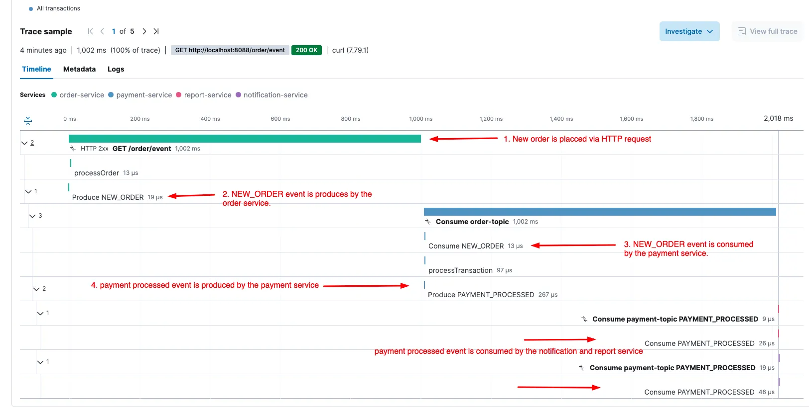

# apm-kafkago

Elastic APM Go agent support for segmentio/kafka-go client.

This package wraps segementio/kafka-go reader and writer to add the traceparent header to the message header and create a new transaction for each message.

## Usage as Consumer

```go
import(
    "github.com/segmentio/kafka-go"
    "github.com/sohaibomr/apm-kafkago"
)
kReader := kafka.NewReader(kafka.ReaderConfig{
  Brokers: []string{kafkaBrokers},
  Topic:   topic,
  GroupID: "payment-group",
 })
 reader := apmkafkago.WrapReader(kReader) // use this reader to read messages, this will parse the Traceparent header from the message header and create a new transaction for each message
```

## Usage as Producer

```go
import(
    "github.com/segmentio/kafka-go"
    "github.com/sohaibomr/apm-kafkago"
)
kWriter := kafka.NewWriter(kafka.WriterConfig{
  Brokers: []string{kafkaBrokers},
  Topic:   topic,
})
writer := apmkafkago.WrapWriter(kWriter) // use this writer to write messages, this will add the Traceparent header to the message header
```

## How will it look on the APM Dashboard ?


